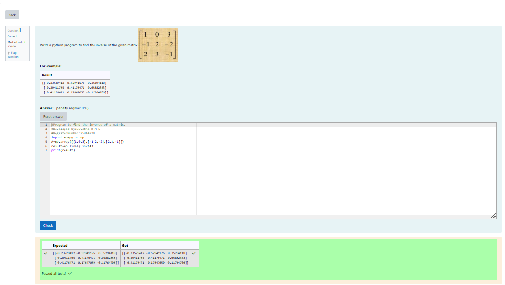

# INVERSE-OF-A-MATRIX
## Aim:
To write a python program to find the inverse of a matrix
## Equipment’s required:
1. 	Hardware – PCs
2. 	Anaconda – Python 3.7 Installation / Moodle-Code Runner
## Algorithm:
### Step1 :
Import the numpy module to use the built-in functions for calculation
### Step 2: 
Prepare the lists from each linear equations and assign in np.array()
### Step 3: 
Using the np.linalg.
matrix_rank(), we can find the rank of the given matrix.
### Step 4: 
End the program
## Program:
#Program to find the inverse of a matrix.

#Developed by:Suvetha K M S

#RegisterNumber:25014228

import numpy as np

A=np.array([[1,0,3],[-1,2,-2],[2,3,-1]])

result=np.linalg.inv(A)

print(result)
## Output:

## Result:
Thus the inverse of given matrix is successfully solved using python program

